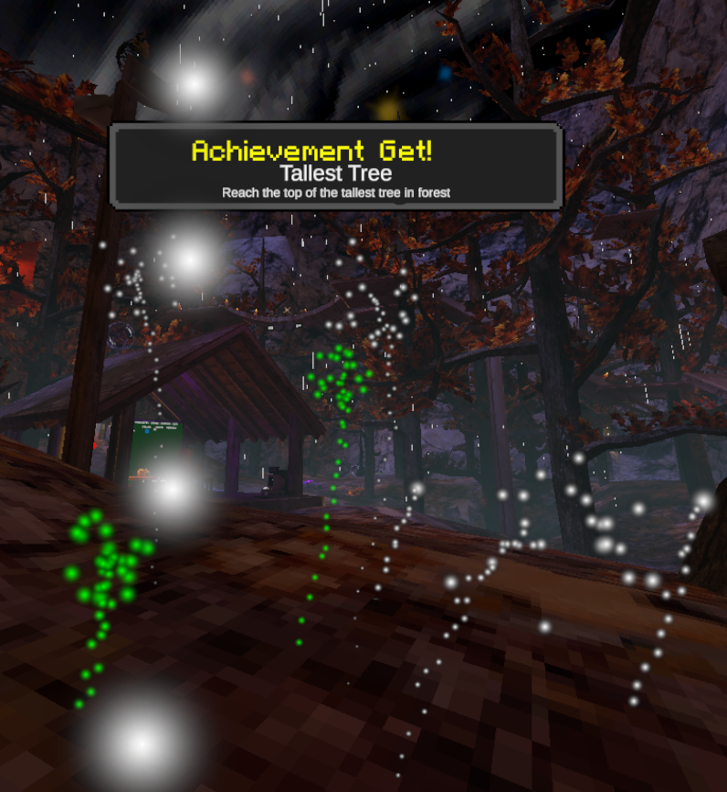

# Gorilla Achievements
A BepInEx mod for Gorilla Tag that gives you achievements for hitting milestones, rare moment and difficult tasks in the game.\
If you find any bugs or issues please report them to the [Issues Tab](https://github.com/lolcaf/GorillaAchievements/issues)



## All Achievements
<details>
  <summary><b>All Achievements</b></summary>
    <p>
      "Tallest Tree", "Reach the top of the tallest tree"</br>
      "Zoomies", "Go super fast zoomy monke!"</br>
      "Infection Time", "Tag another monke in infection"</br>
      "Swimmer", "Swim in water"</br>
      "Shopping Spree", "Purchase a cosmetic"</br>
      "Rainy Day", "Experience the rain"</br>
      "Splash Zone", "Fall into water from a high place"</br>
      "Going Up", "Ride the elevator to another location"</br>
      "Patient Zero", "Be the first tagged in an infection lobby"</br>
      "Last Laugh", "Be the last survivor in an infection round"</br>
      "Ghost Hunter", "Enter a ghost code"</br>
      "Pro Modder", "Have 10+ mods installed"</br>
      "Supporter", "Have another one of my mods installed <3"</br>
      "Tourist", "Visit all the classic maps"</br>
      "Marathon", "Travel a long distance"</br>
      "Revenge Tag", "Tag someone who tagged you in infection"</br>
      "Larper", "Find someone impersonating a popular youtuber"</br>
      "It's Crowded Here", "Play in a lobby with 15+ players"</br>
      "Back Again", "Join a public lobby you were previously in"</br>
      "AAC", "Meet an AA Creator (Only awards if the player is wearing AAC badge)"</br>
      "Finger Painter", "Meet a Finger Painter (Only awards if the player is wearing fp)"</br>
    </p>
  </details>

## For Developers
You can now make plugins for Gorilla Achievements!\
You and your users must have 1.1.0+ for the plugins to work!\
I made an [Example Plugin](https://github.com/lolcaf/GAExamplePlugin) if you want to see that instead.\
It is easy, no fancy inheritance or complex code you need to understand
### Depend
You need to depend on GA with BepInEx
```c#
[BepInDependency("com.lolcaf.gorillatag.gachievements", "1.1.0")] // Depend on Gorilla Achievements 1.1.0+
[BepInPlugin("com.lolcaf.gaexampleplugin", "GAExamplePlugin", "1.0.0")]
public class ExamplePlugin : BaseUnityPlugin
```
### GA Namespaces
This is how you access the Achievement class and Difficulty enum
```c#
using GorillaAchievements.Classes;
```
### Variables
You should make a `Achievement[]` or `List<Achievement>` to store all your achievements.\
*if you ever need you can find GorillaAchievements.Plugin.realAllAchievements to get all existing achievements*
```c#
private Achievement[] myAchievements;
```
### Start Method
Here is an example Start method containing everything you need!
```c#
private void Start()
{
    // If your mod is in debug mode then enable this to see debug notifications from GA (DEFAULT: FALSE)
    GorillaAchievements.Plugin.debugMode = true;

    // Create your list in the start method
    myAchievements = [
        GorillaAchievements.Plugin.A("Example Achievement", "My example achievement", Difficulty.Easy, Vector3.zero), // Use this 'A' method to create a new Achievement
        GorillaAchievements.Plugin.A("Example Achievement2", "My other example achievement", Difficulty.Easy, Vector3.zero),
    ];
}
```
### Find Achievements
You can find achievements with a reference to a variable or with a GorillaAchievements method, it looks through all existing achievements (will return null if not found)
```c#
GorillaAchievements.Plugin.FindAchievement("Example Achievement");
```
### Awarding
You will have to handle the awarding yourself.\
If you want your achievement to be awarded by reaching a position in the world then you can simply input it into the 'A' method like this.
```c#
GorillaAchievements.Plugin.A("Example Name", "Example Description", Difficulty.Easy, new Vector3(10, 20, -10));
```
Input `Vector3.zero` if you don't want it to be awarded by a position
```c#
GorillaAchievements.Plugin.A("Example Name", "Example Description", Difficulty.Easy, Vector3.zero);
```
If you want to manually award your mod then use
```c#
GorillaAchievements.Plugin.Instance.AwardAchievement(GorillaAchievements.Plugin.FindAchievement("Example Achievement2"));
```
Here is an example from the example plugin
```c#
private void OnRoomJoined()
{
    // Use AwardAchievement to award an achievement
    // Use FindAchievement to find an achievement with that name (looks through a list of all existing achievements, returns null if not found)
    GorillaAchievements.Plugin.Instance.AwardAchievement(GorillaAchievements.Plugin.FindAchievement("Example Achievement"));

    if (NetworkSystem.Instance.RoomName == "LOLCAF")
    {
        GorillaAchievements.Plugin.Instance.AwardAchievement(GorillaAchievements.Plugin.FindAchievement("Example Achievement2"));
    }
}
```
That should be it! I told you it would be simple and easy
## Dependency
This mod has no dependency :thumbsup:

## Disclaimer
This product is not affiliated with Another Axiom Inc. or its videogames Gorilla Tag and Orion Drift and is not endorsed or otherwise sponsored by Another Axiom. Portions of the materials contained herein are property of Another Axiom. ©2021 Another Axiom Inc.
